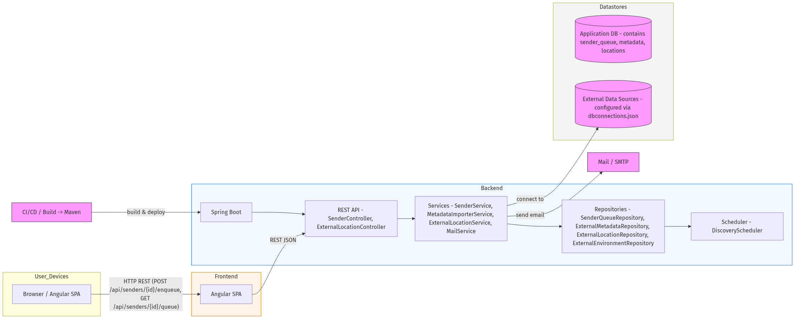
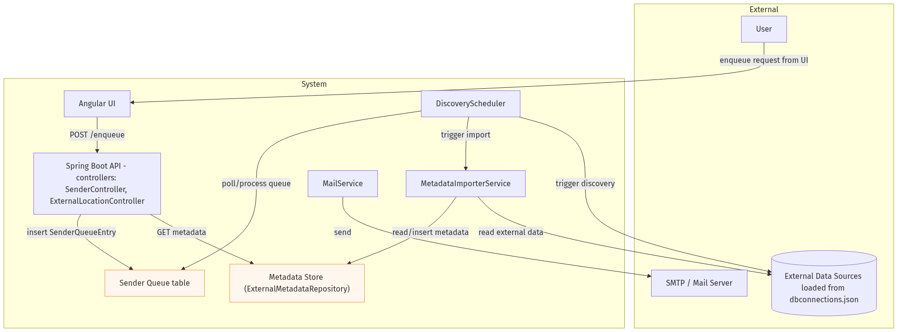
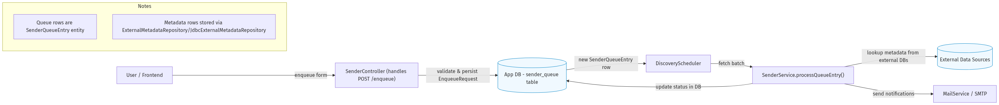
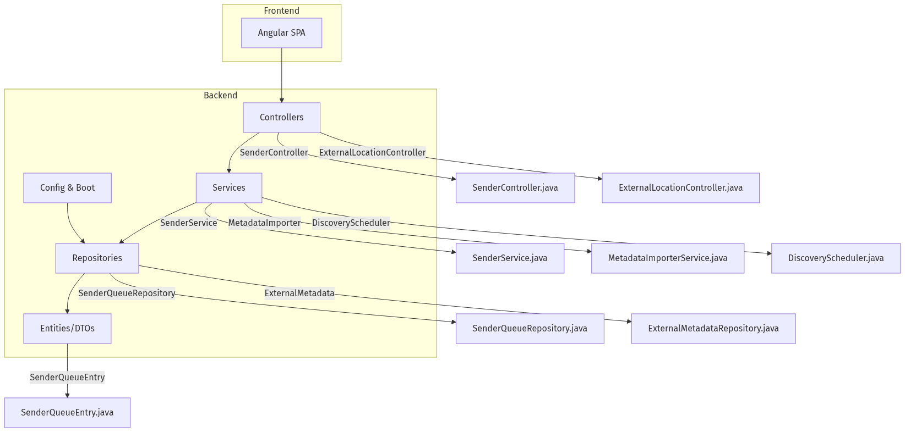
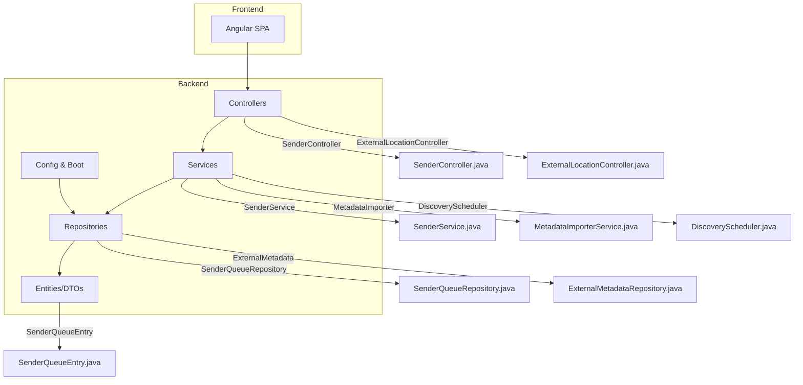
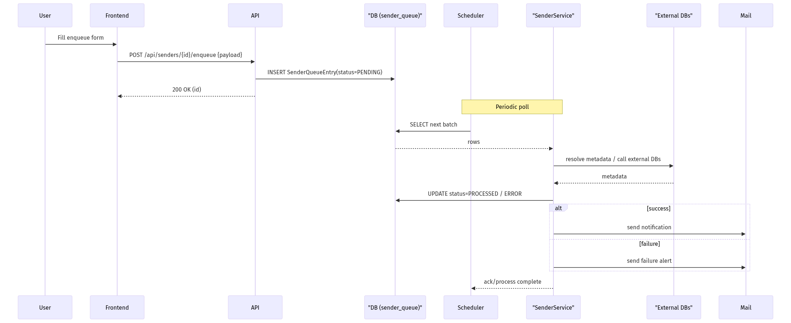
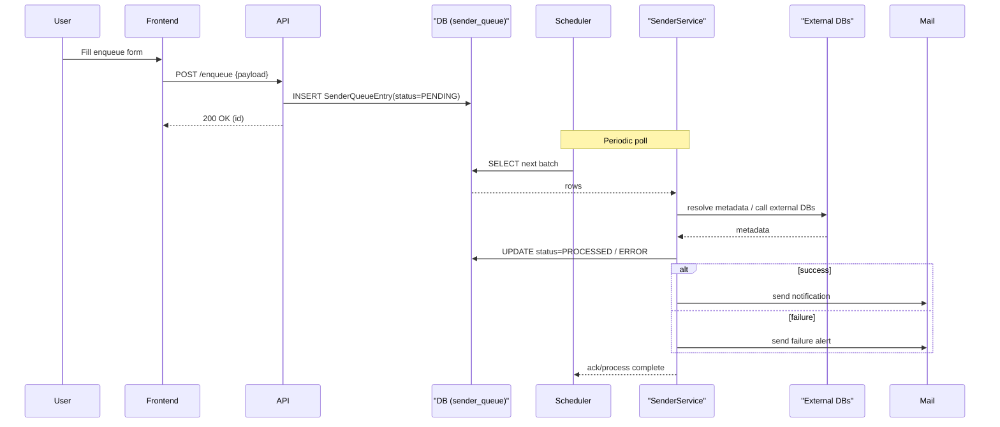

# Architecture

This document describes the architecture, data flows, and deployment notes for the reloader app (Angular frontend + Spring Boot backend).

## Overview

Purpose: The app accepts "enqueue" requests from the UI which create `SenderQueueEntry` rows. A scheduler processes the queue, looks up metadata in external data sources, updates statuses in the application DB, and optionally sends notifications.

Key components

- Frontend (Angular)
  - `frontend/src/app/*` - UI and HTTP client
- Backend (Spring Boot)
  - Controllers: `SenderController.java`, `ExternalLocationController.java`, `ReloaderController.java`, `DevDbInspectController.java`
  - Services: `SenderService.java`, `MetadataImporterService.java`, `ExternalLocationService.java`, `MailService.java`, `DiscoveryScheduler.java`
  - Repositories: `SenderQueueRepository.java`, `ExternalMetadataRepository.java`, `JdbcExternalMetadataRepository.java`, `ExternalLocationRepository.java`, `ExternalEnvironmentRepository.java`
  - Entities/DTOs: `SenderQueueEntry.java`, `ExternalLocation.java`, `ExternalEnvironment.java`, `MetadataRow.java`, DTOs under `web/dto/`
  - Config & boot: `ReloaderApplication.java`, `ExternalDbConfig.java`, `DiscoveryProperties.java`, `ExternalLocationDataLoader.java`

### Contract: enqueue -> process
- Input: POST `/enqueue` (body = `EnqueueRequest`) from frontend
- Output: 200 OK with `EnqueueResult` (id) or validation 4xx
- Processing: `DiscoveryScheduler` / `SenderService` reads `sender_queue` rows and resolves metadata via `JdbcExternalMetadataRepository`, updates row status, and triggers `MailService` on events.
- Errors: validation errors (4xx), DB/external connectivity (5xx/transient), processing errors (per-entry ERROR marking). See `backend/scripts` for dedupe SQL.

---

## System flow

Below is a high-level system flow diagram. A rendered image is included first for environments that can't render Mermaid; the Mermaid block follows for editors that do render it.



```mermaid
flowchart LR
  subgraph User Devices
    Browser[Browser / Angular SPA]
  end

  subgraph Frontend
    Browser -->|HTTP REST (POST /enqueue, GET /status)| FrontendApp[Angular SPA]
  end

  subgraph Backend "Spring Boot"
    API[REST API - SenderController, ExternalLocationController]
    Services[Services - SenderService, MetadataImporterService, ExternalLocationService, MailService]
    Repos[Repositories - SenderQueueRepository, ExternalMetadataRepository, ExternalLocationRepository, ExternalEnvironmentRepository]
    Scheduler[Scheduler - DiscoveryScheduler]
  end

  subgraph Datastores
    AppDB[(Application DB)]
    ExternalDBs[(External/Data Sources) - via ExternalDbConfig]
  end

  SMTP[Mail / SMTP]
  CI[CI/CD / Build -> Maven]

  FrontendApp -->|REST calls JSON| API
  API --> Services
  Services --> Repos
  Repos --> AppDB
  Services -->|connect| ExternalDBs
  Scheduler --> Services
  Services -->|send email| SMTP
  CI -->|build & deploy| Backend

  classDef infra fill:#f9f,stroke:#333,stroke-width:1px;
  class ExternalDBs,AppDB,SMTP,CI infra
```

---

## Data Flow Diagrams (DFD)

### DFD Level 0 (context)



```mermaid
graph TD
  subgraph External
    User[User]
    ExternalDBs[(External Data Sources)]
    SMTP[SMTP / Mail Server]
  end

  subgraph System
    UI[Angular UI]
    API[Spring Boot API]
    Queue[Sender Queue (DB table, SenderQueueRepository)]
    Metadata[Metadata Store]
    Scheduler[DiscoveryScheduler]
    Importer[MetadataImporterService]
    Mail[MailService]
  end

  User -->|enqueue request| UI
  UI -->|POST /enqueue| API
  API -->|insert| Queue
  Scheduler -->|poll/process| Queue
  Scheduler -->|call| Importer
  Importer -->|read/insert| Metadata
  Importer -->|read external data| ExternalDBs
  Scheduler -->|trigger discovery| ExternalDBs
  Mail -->|send| SMTP
  API -->|GET| Metadata

  classDef data fill:#fff7ed,stroke:#fb923c
  class Queue,Metadata data
```

### DFD Level 1 (enqueue -> queue -> processing)



```mermaid
flowchart LR
  %% Level 1 DFD: Enqueue -> Queue -> Processing
  User[User / Frontend]
  API[SenderController (POST /enqueue)]
  DB[(App DB) - sender_queue table]
  Scheduler[DiscoveryScheduler]
  Processor[SenderService.processQueueEntry()]
  ExternalDBs[(External Data Sources)]
  Mail[MailService / SMTP]

  User -->|enqueue form| API
  API -->|validate & persist| DB
  DB -->|new row| Scheduler
  Scheduler -->|fetch batch| Processor
  Processor -->|lookup metadata| ExternalDBs
  Processor -->|update status| DB
  Processor -->|send notifications| Mail

  classDef datastore fill:#f0f9ff,stroke:#0284c7
  class DB,ExternalDBs datastore
```

---

## Component & Sequence Diagrams

### Component diagram





### Sequence diagram (enqueue -> process)





---

## Deployment & operational notes

Build & run

- Backend (Maven, Java 17+)
  - Build: `mvn -f backend clean package`
  - Run: `mvn -f backend spring-boot:run` or `java -jar backend/target/<artifact>.jar`
- Frontend (Node 20+)
  - Install: `cd frontend && npm ci`
  - Unit tests (headless):

```bash
CHROME_BIN=/usr/bin/google-chrome-stable npm run test -- --watch=false --browsers=ChromeHeadless
```

Configuration

- Application DB: configured via `src/main/resources/application.properties`.
- External DBs: configured via `dbconnections.json` (example under resources).
- Discovery scheduler: configurable via `DiscoveryProperties`.
- Mail: configured via Spring mail properties in `application.properties`.

Operational checklist

- Ensure Liquibase changelogs under `src/main/resources/db/changelog` have been applied.
- Verify `dbconnections.json` has valid JDBC URLs for external DBs.
- Tune `DiscoveryProperties` for batch sizes and intervals.
- Use `backend/scripts/dedupe_sender_queue_keep_lowest_id.sql` when deduping is needed.

Monitoring & health

- Add Spring Boot Actuator endpoints for readiness/liveness and DB health checks.
- Export metrics for queue depth and error rates.

Security & secrets

- Use environment variables or a secrets manager to provide DB and SMTP credentials.
- Restrict `DevDbInspectController` and dev endpoints to non-production profiles.

## Authentication

The backend exposes a small authentication API used by the frontend. Documenting it here helps devs understand the auth flow:

- POST /api/auth/login
  - Request: JSON { username, password }
  - Response: JSON { accessToken }
  - Side effect: sets an HttpOnly cookie named `refresh_token` (rotating, persisted server-side). The access token is a short-lived JWT used in the `Authorization: Bearer <token>` header.

- POST /api/auth/refresh
  - Request: (no body) — the refresh cookie is read automatically by the server
  - Response: JSON { accessToken }
  - Side effect: rotates the `refresh_token` cookie (server persists the new token and revokes the previous one).

- POST /api/auth/logout
  - Request: (no body) — the refresh cookie is read and revoked
  - Response: 200 OK

Notes:

- The frontend attaches the JWT `accessToken` to outgoing API calls in the `Authorization` header. When a 401 is encountered the frontend can call `/api/auth/refresh` to obtain a new access token; the refresh endpoint relies on the HttpOnly `refresh_token` cookie so the browser sends it automatically.
- Because the refresh token is stored in an HttpOnly cookie and persisted on the server, automated clients and integration tests may need to capture and replay the cookie (the repo includes a small test helper used by integration tests).
---

## Where to go from here

- Regenerating diagrams: see `docs/REGEN_DIAGRAMS.md` and `docs/regen_diagrams.sh`.
- I can open a PR with these docs and images if you want to publish them.

---

(End of document)
