# Architecture

This document describes the architecture, data flows, and deployment notes for the reloader app (Angular frontend + Spring Boot backend).

## Overview

Purpose: The app accepts "enqueue" requests from the UI which create `SenderQueueEntry` rows. A scheduler processes the queue, looks up metadata in external data sources, updates statuses in the application DB, and optionally sends notifications.

Key components

- Frontend (Angular)
  - `frontend/src/app/*` - UI and HTTP client
- Backend (Spring Boot)
  - Controllers: `SenderController.java`, `ExternalLocationController.java`, `ReloaderController.java`, `DevDbInspectController.java`


```mermaid
flowchart LR
  subgraph User Devices
    Browser[Browser / Angular SPA]
  end

  subgraph Frontend
    Browser -->|HTTP REST (POST /enqueue, GET /status)| FrontendApp[Angular SPA]
  end

  subgraph Backend "Spring Boot"
    API[REST API - `SenderController`, `ExternalLocationController`]
    Services[Services - `SenderService`, `MetadataImporterService`, `ExternalLocationService`, `MailService`]
    Repos[Repositories - `SenderQueueRepository`, `ExternalMetadataRepository`, `ExternalLocationRepository`, `ExternalEnvironmentRepository`]
    Scheduler[Scheduler - `DiscoveryScheduler`]
  end

  subgraph Datastores
    AppDB[(Application DB)]
    ExternalDBs[(External/Data Sources) - via `ExternalDbConfig`]
  end

  SMTP[Mail / SMTP]
  CI[CI/CD / Build -> Maven]

  FrontendApp -->|REST calls JSON| API
  API --> Services
  Services --> Repos
  Repos --> AppDB
  Services -->|connect| ExternalDBs
  Scheduler --> Services
  Services -->|send email| SMTP
  CI -->|build & deploy| Backend

  classDef infra fill:#f9f,stroke:#333,stroke-width:1px;
  class ExternalDBs,AppDB,SMTP,CI infra

  %% Notes
  click ExternalDBs "#" "External DBs loaded from dbconnections.json"
  click AppDB "#" "Application DB contains sender queue, metadata, locations"

  style Backend fill:#f2f8ff,stroke:#0366d6
  style Frontend fill:#fff4e6,stroke:#d97706
  style Datastores fill:#f3f4f6

  %% Components mapping hints
  note right of API
    Controllers: ReloaderController, SenderController,
    ExternalLocationController, DevDbInspectController
  end
  note right of Services
    Key services: SenderService, MetadataImporterService,
    ExternalLocationService, MailService, DiscoveryScheduler
  end
  note right of Repos
    Repositories/Jdbc implementations for metadata and sender queue
  end
```
  Repos --> AppDB
  Services -->|connect| ExternalDBs
  Scheduler --> Services
  Services -->|send email| SMTP
  CI -->|build & deploy| Backend

  classDef infra fill:#f9f,stroke:#333,stroke-width:1px;
  class ExternalDBs,AppDB,SMTP,CI infra

  %% Notes
  click ExternalDBs "#" "External DBs loaded from dbconnections.json"
  click AppDB "#" "Application DB contains sender queue, metadata, locations"

  style Backend fill:#f2f8ff,stroke:#0366d6
  style Frontend fill:#fff4e6,stroke:#d97706
  style Datastores fill:#f3f4f6

  %% Components mapping hints
  note right of API
    Controllers: ReloaderController, SenderController,
    ExternalLocationController, DevDbInspectController
  end
  note right of Services
    Key services: SenderService, MetadataImporterService,
    ExternalLocationService, MailService, DiscoveryScheduler
  end
  note right of Repos
    Repositories/Jdbc implementations for metadata and sender queue
  end
```

---

## Data Flow Diagrams (DFD)

### DFD Level 0 (context)

graph TD


```mermaid
graph TD
  subgraph External
    User[User]
    ExternalDBs[(External Data Sources)]
    SMTP[SMTP / Mail Server]
  end

  subgraph System
    UI[Angular UI]
    API[Spring Boot API]
    Queue[Sender Queue (DB table, SenderQueueRepository)]
    Metadata[Metadata Store]
    Scheduler[DiscoveryScheduler]
    Importer[MetadataImporterService]
    Mail[MailService]
  end

  User -->|enqueue request| UI
  UI -->|POST /enqueue| API
  API -->|insert| Queue
  Scheduler -->|poll/process| Queue
  Scheduler -->|call| Importer
  Importer -->|read/insert| Metadata
  Importer -->|read external data| ExternalDBs
  Scheduler -->|trigger discovery| ExternalDBs
  Mail -->|send| SMTP
  API -->|GET| Metadata

  classDef data fill:#fff7ed,stroke:#fb923c
  class Queue,Metadata data
```
  %% Level 0 legend
  subgraph Legend
    L1[Process: API, Scheduler, Importer]
    L2[Data stores: Queue, Metadata]
    L3[External: ExternalDBs, SMTP]
  end
  linkStyle 0 stroke:#333,stroke-width:2px
```

### DFD Level 1 (enqueue -> queue -> processing)


```mermaid
flowchart LR
  %% Level 1 DFD: Enqueue -> Queue -> Processing
  User[User / Frontend]
  API[SenderController (POST /enqueue)]
  DB[(App DB) - sender_queue table]
  Scheduler[DiscoveryScheduler]
  Processor[SenderService.processQueueEntry()]
  ExternalDBs[(External Data Sources)]
  Mail[MailService / SMTP]

  User -->|enqueue form| API
  API -->|validate & persist| DB
  DB -->|new row| Scheduler
  Scheduler -->|fetch batch| Processor
  Processor -->|lookup metadata| ExternalDBs
  Processor -->|update status| DB
  Processor -->|send notifications| Mail

  classDef datastore fill:#f0f9ff,stroke:#0284c7
  class DB,ExternalDBs datastore

  subgraph Notes
    N1[Queue rows represented by SenderQueueEntry entity]
    N2[Metadata rows in ExternalMetadataRepository / JdbcExternalMetadataRepository]
  end
```

---

## Component & Sequence Diagrams

### Component diagram

graph TD


  classDef file fill:#fff,stroke:#6b7280
```

### Sequence diagram (enqueue -> process)


---

## Deployment & operational notes

Build & run

- Backend (Maven, Java 17+)
  - Build: `mvn -f backend clean package`
  - Run: `mvn -f backend spring-boot:run` or `java -jar backend/target/<artifact>.jar`
- Frontend (Node 20+)
  - Install: `cd frontend && npm ci`
  - Unit tests (headless):

```bash
CHROME_BIN=/usr/bin/google-chrome-stable npm run test -- --watch=false --browsers=ChromeHeadless
```

Configuration

- Application DB: configured via `src/main/resources/application.properties`.
- External DBs: configured via `dbconnections.json` (example under resources).
- Discovery scheduler: configurable via `DiscoveryProperties`.
- Mail: configured via Spring mail properties in `application.properties`.

Operational checklist

- Ensure Liquibase changelogs under `src/main/resources/db/changelog` have been applied.
- Verify `dbconnections.json` has valid JDBC URLs for external DBs.
- Tune `DiscoveryProperties` for batch sizes and intervals.
- Use `backend/scripts/dedupe_sender_queue_keep_lowest_id.sql` when deduping is needed.

Monitoring & health

- Add Spring Boot Actuator endpoints for readiness/liveness and DB health checks.
- Export metrics for queue depth and error rates.

Security & secrets

- Use environment variables or a secrets manager to provide DB and SMTP credentials.
- Restrict `DevDbInspectController` and dev endpoints to non-production profiles.

---

## Where to go from here

- I can add these diagrams to `docs/ARCHITECTURE.md` as rendered images (SVG/PNG), or leave them as Mermaid blocks (as done here). If you want SVGs in the repo, I can generate and add them.
- I can also add a small `docs/README.md` linking this file and the build/test quickstart if you'd like.

---

(End of document)
